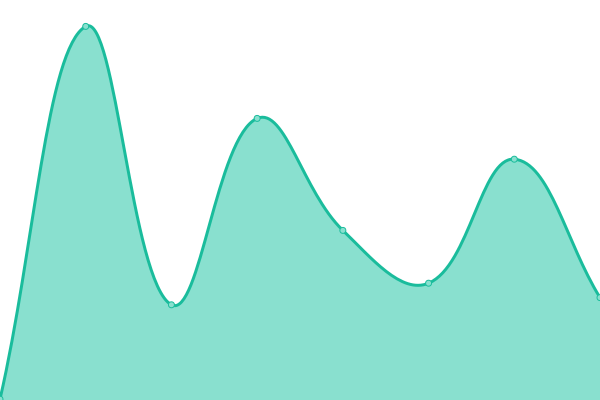
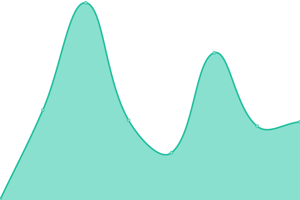
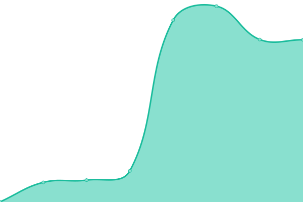
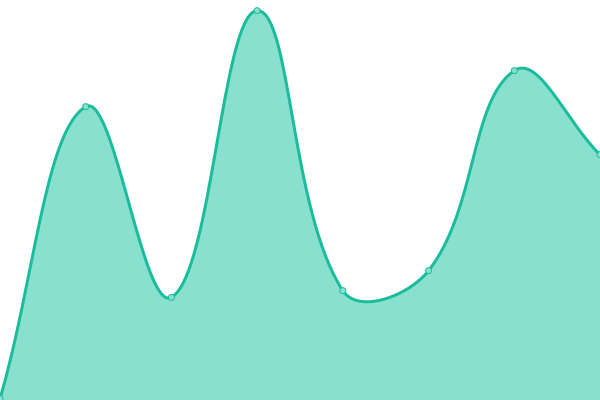
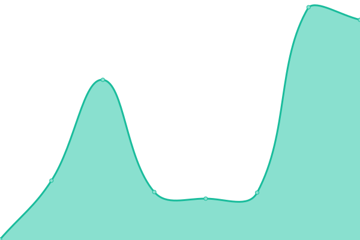
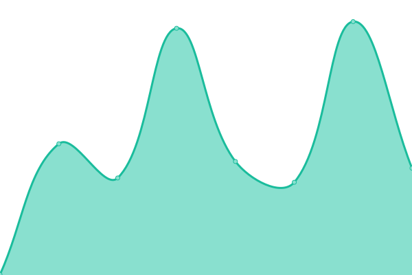
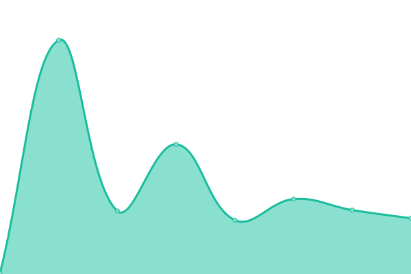

# [📈 Live Status](https://rowink.github.io/upptime): <!--live status--> **🟩 All systems operational**

This repository contains the open-source uptime monitor and status page for [rowink](exi.ink), powered by [Upptime](https://github.com/upptime/upptime).

With [Upptime](https://upptime.js.org), you can get your own unlimited and free uptime monitor and status page, powered entirely by a GitHub repository. We use [Issues](https://github.com/rowink/upptime/issues) as incident reports, [Actions](https://github.com/rowink/upptime/actions) as uptime monitors, and [Pages](https://rowink.github.io/upptime) for the status page.

<!--start: status pages-->
<!-- This summary is generated by Upptime (https://github.com/upptime/upptime) -->
<!-- Do not edit this manually, your changes will be overwritten -->
<!-- prettier-ignore -->
| URL | Status | History | Response Time | Uptime |
| --- | ------ | ------- | ------------- | ------ |
|  [lab](https://exi.software/) | 🟩 Up | [lab.yml](https://github.com/rowink/upptime/commits/HEAD/history/lab.yml) | 

 342ms
     
 | 

<a href="https://status.exi.software/history/lab">100.00%</a>
    

|  [blog](https://exi.ink/) | 🟩 Up | [blog.yml](https://github.com/rowink/upptime/commits/HEAD/history/blog.yml) | 

 372ms
     
 | 

<a href="https://status.exi.software/history/blog">100.00%</a>
    

|  [note](https://m.exi.ink/) | 🟩 Up | [note.yml](https://github.com/rowink/upptime/commits/HEAD/history/note.yml) | 

 348ms
     
 | 

<a href="https://status.exi.software/history/note">100.00%</a>
    

|  [monitor](https://status.exi.software/) | 🟩 Up | [monitor.yml](https://github.com/rowink/upptime/commits/HEAD/history/monitor.yml) | 

 186ms
     
 | 

<a href="https://status.exi.software/history/monitor">100.00%</a>
    

|  [github proxy](https://git.exi.software/) | 🟩 Up | [github-proxy.yml](https://github.com/rowink/upptime/commits/HEAD/history/github-proxy.yml) | 

 119ms
     
 | 

<a href="https://status.exi.software/history/github-proxy">100.00%</a>
    

|  [Ecloud](https://drive.exi.software/) | 🟩 Up | [ecloud.yml](https://github.com/rowink/upptime/commits/HEAD/history/ecloud.yml) | 

 1972ms
     
 | 

<a href="https://status.exi.software/history/ecloud">100.00%</a>
    

|  [chatGPT demo](https://chat.exi.software/) | 🟩 Up | [chat-gpt-demo.yml](https://github.com/rowink/upptime/commits/HEAD/history/chat-gpt-demo.yml) | 

 499ms
     
 | 

<a href="https://status.exi.software/history/chat-gpt-demo">100.00%</a>
    

|  [picture bed](https://pic.exi.software/) | 🟩 Up | [picture-bed.yml](https://github.com/rowink/upptime/commits/HEAD/history/picture-bed.yml) | 

 140ms
     
 | 

<a href="https://status.exi.software/history/picture-bed">100.00%</a>
    

|  [short link](https://short.exi.software/) | 🟩 Up | [short-link.yml](https://github.com/rowink/upptime/commits/HEAD/history/short-link.yml) | 

 246ms
     
 | 

<a href="https://status.exi.software/history/short-link">100.00%</a>
    

|  [cloud notepad](https://note.exi.software) | 🟩 Up | [cloud-notepad.yml](https://github.com/rowink/upptime/commits/HEAD/history/cloud-notepad.yml) | 

 318ms
     
 | 

<a href="https://status.exi.software/history/cloud-notepad">100.00%</a>
    

|  [txtable](https://table.exi.software/) | 🟩 Up | [txtable.yml](https://github.com/rowink/upptime/commits/HEAD/history/txtable.yml) | 

 146ms
     
 | 

<a href="https://status.exi.software/history/txtable">100.00%</a>
    

|  [qrcode](https://qrcode.exi.software/) | 🟩 Up | [qrcode.yml](https://github.com/rowink/upptime/commits/HEAD/history/qrcode.yml) | 

 82ms
     
 | 

<a href="https://status.exi.software/history/qrcode">100.00%</a>
    

|  [utxt](https://txt.exi.software/) | 🟩 Up | [utxt.yml](https://github.com/rowink/upptime/commits/HEAD/history/utxt.yml) | 

 102ms
     
 | 

<a href="https://status.exi.software/history/utxt">100.00%</a>
    

<!--end: status pages-->

[**Visit our status website →**](https://rowink.github.io/upptime)

## 📄 License

- Powered by: [Upptime](https://github.com/upptime/upptime)
- Code: [MIT](./LICENSE) © [rowink](exi.software)
- Data in the `./history` directory: [Open Database License](https://opendatacommons.org/licenses/odbl/1-0/)
